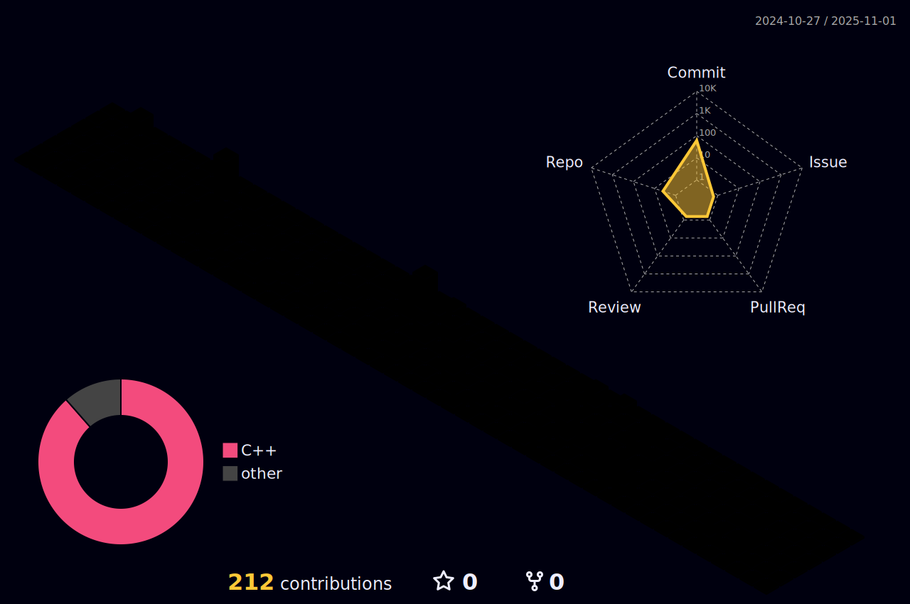

  

###

  
  

###

<h3 align="left">👩‍💻  About Me</h3>

###

Hi! My name is Izzani. I am from Port Dickson, Negeri Sembilan, Malaysia 🇲🇾  - 🔭 I’m working as Design Engineer at Cytron Technologies, Malaysia - 📚 I'm currently learning ZephyrRTOS  - ⚡ In my free time I hangout in cafe while drinking matcha while code

###

<h3 align="left">🔥   My Stats :</h3>

###

  

###

